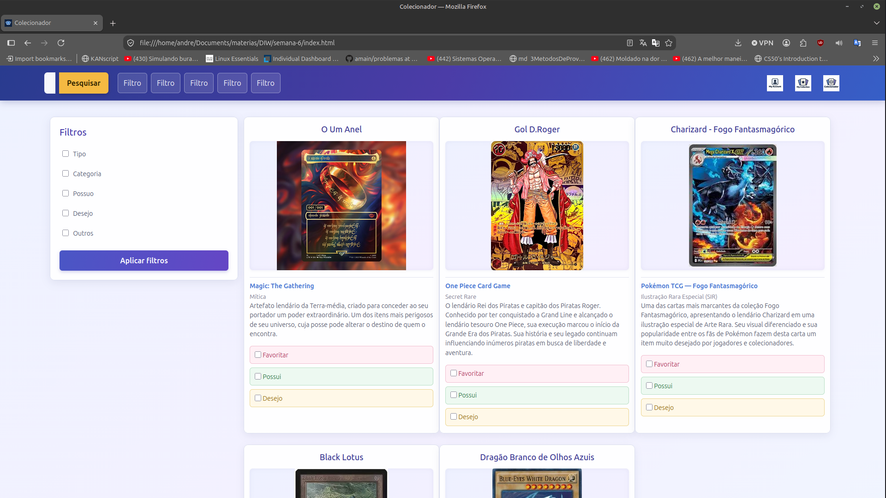
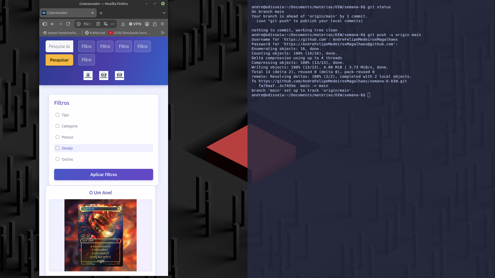

Repositório Destinado a atividade prática de DIW - Semana6:

- Matrículo: 890100;
- Nome: André Felipe Medeiros Magalhães;
- Curso: Ciências da Computação;

> Implementação de frameWork BootStrap no projeto, trocando a responsividade nativa do CSS por bootStrap;

